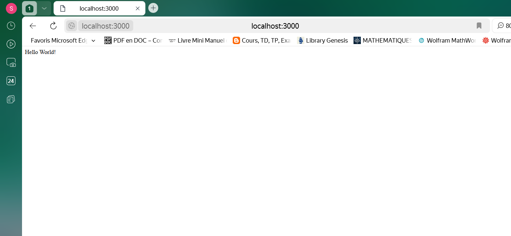
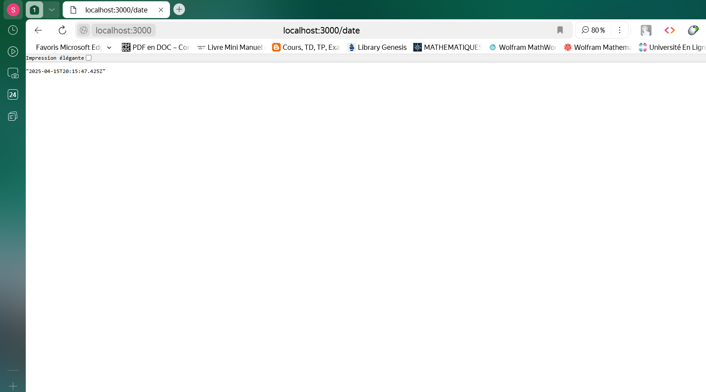

# Exo1 : Serveur Express basique

## 📸 Capture d'écran  
  
  
  

## 📝 Description  
Cet exercice consiste à créer un serveur Express qui répond à la route `/` avec un message "Hello World".  

Ensuite il affiche sur la route `/date`, la date en temps réelle de l'exécution de cette page.  

