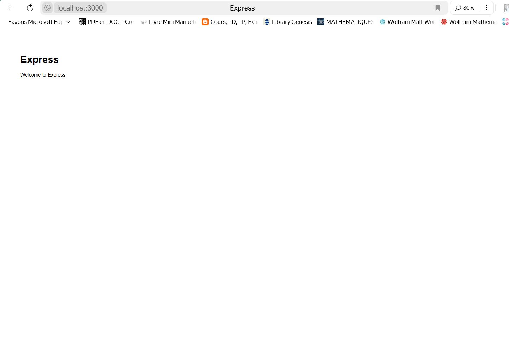
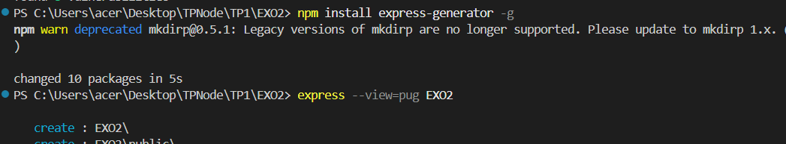
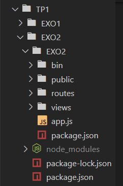

# Exo2 : Configuration d'un projet ExpressJS avec Express Generator

## 📸 Capture d'écran  
  
  
  


## 📝 Description  
Cet exercice consiste à créer un serveur Express à travers la commande de express generator 

```bash
npm install -g express-generator
```
Ensuite, on créer un nouveau projet dans notre EXO2 avec la commande :
```bash
 set DEBUG=EXO2:* 
```
Démarrer le Serveur
```bash
npm start
```

Accédez à l'application : [http://localhost:3000](http://localhost:3000).
