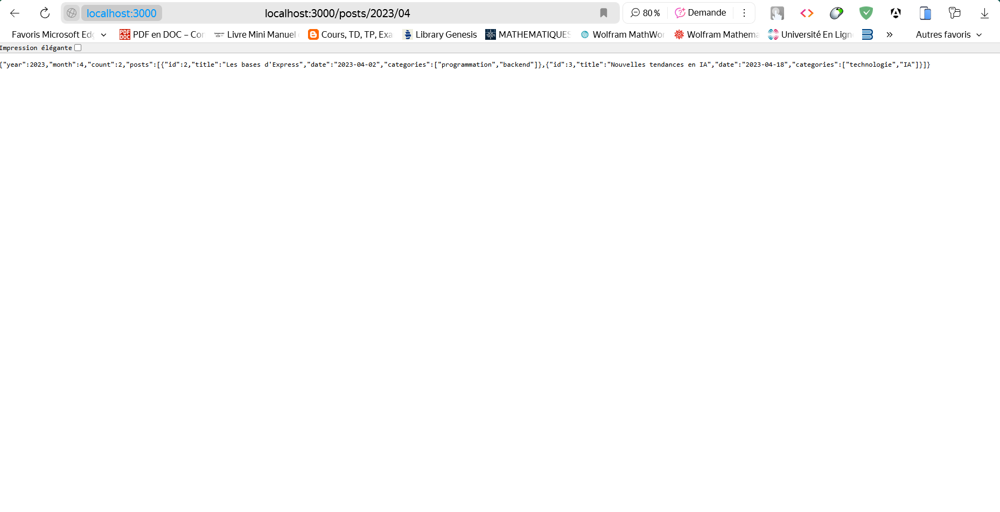
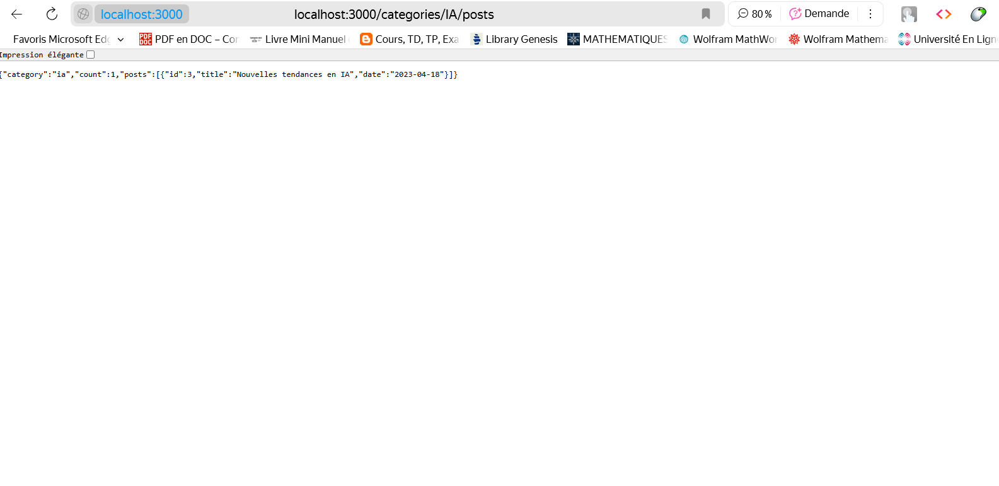

# Implémenter des routes paramétrées / Créez une API pour un blog avec des routes paramétrées 

## 📸 Capture d'écran  :

# GET /posts/:year/:month? - Récupérer les articles d'une année et optionnellement d'un mois spécifique

 

# GET /categories/:categoryName/posts - Récupérer les articles d'une catégorie spécifique

  

## 📝 Description  

Exercice 2: Implémenter des routes paramétrées
Créez une API pour un blog avec des routes paramétrées :

GET /posts/:year/:month? - Récupérer les articles d'une année et optionnellement d'un mois spécifique
GET /categories/:categoryName/posts - Récupérer les articles d'une catégorie spécifique

