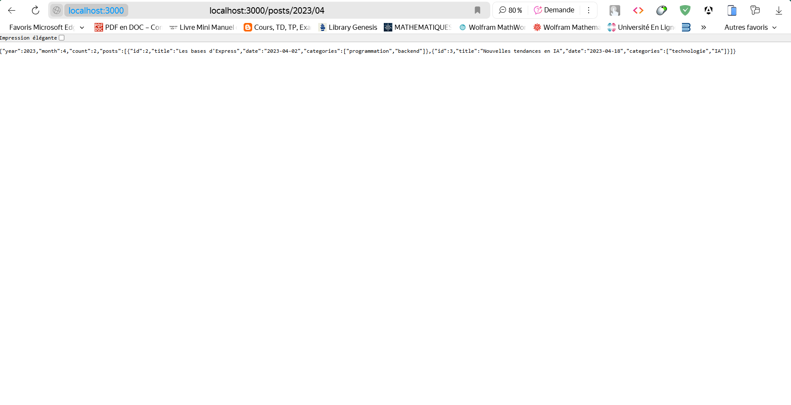
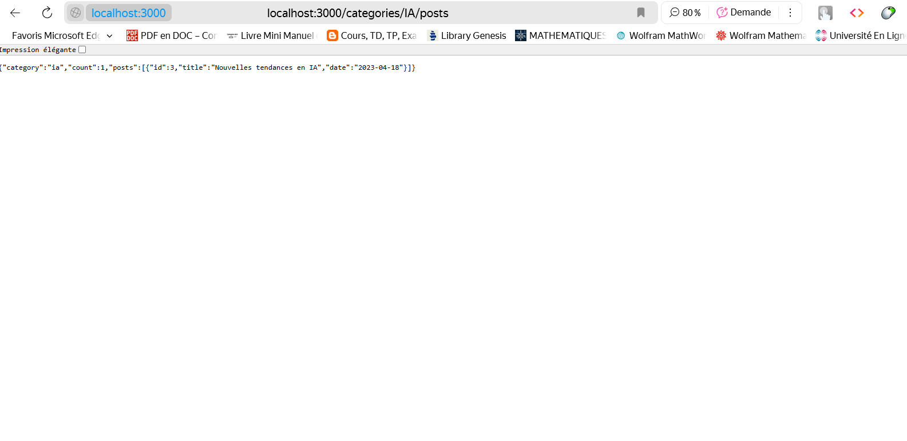

# Organiser une application avec des routeurs modulaires

## 📸 Capture d'écran  :

# GET /posts/:year/:month? - Récupérer les articles d'une année et optionnellement d'un mois spécifique

 

# GET /categories/:categoryName/posts - Récupérer les articles d'une catégorie spécifique

  

## 📝 Description  

Exercice 3: Organiser une application avec des routeurs modulaires
Réorganisez une application Express existante en utilisant des routeurs modulaires pour différentes ressources (utilisateurs, produits, commandes, etc.).