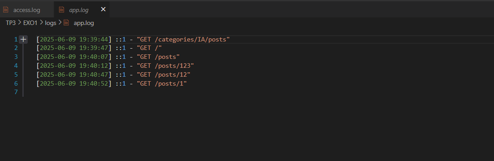

# Créer un middleware de logging personnalisé

## 📸 Capture d'écran  :

# Le fichier de log où sont enregistrés les détails de chaque requête (méthode, URL, heure, adresse IP) .

 

## 📝 Description  

Exercice 1: Créer un middleware de logging personnalisé
Créez un middleware qui enregistre les détails de chaque requête (méthode, URL, heure, adresse IP) dans un fichier de log.