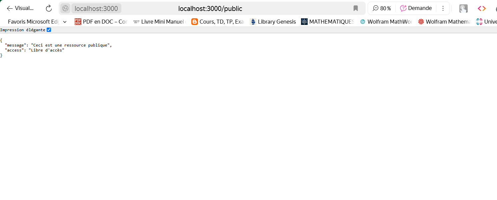
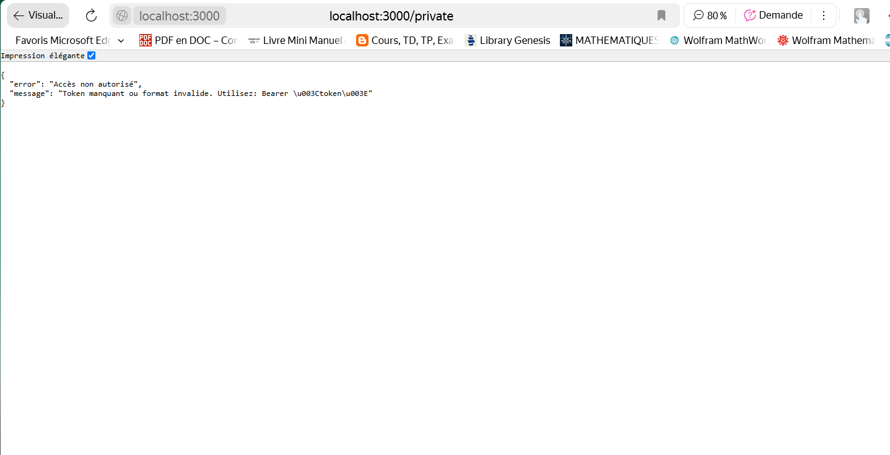

# Implémenter un middleware d'authentification simple

## 📸 Capture d'écran  :

# Accès Autorisé Public

 

# Accès non Autorisé Private.

 

## 📝 Description  

Exercice 2: Implémenter un middleware d'authentification simple
Créez un middleware qui vérifie si une requête contient un token valide dans les en-têtes et refuse l'accès si ce n'est pas le cas.