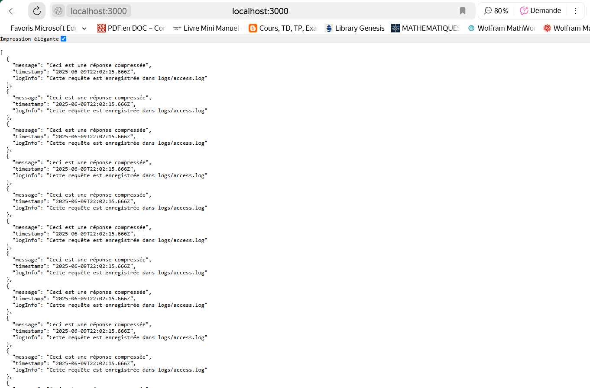
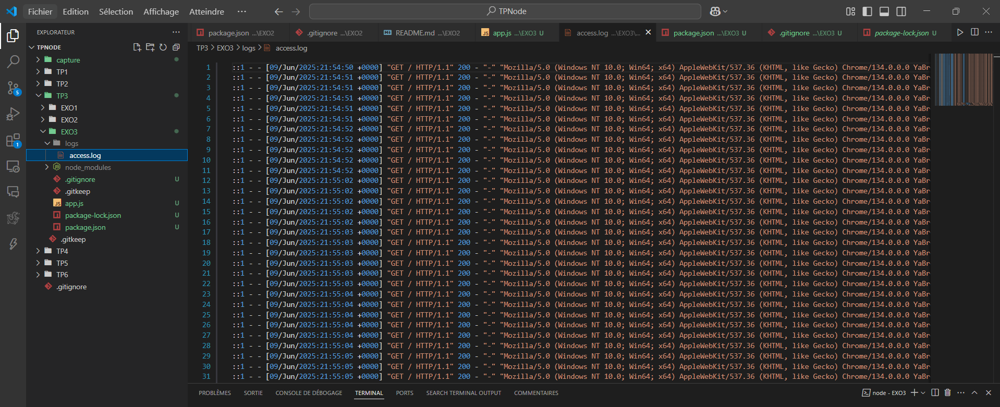
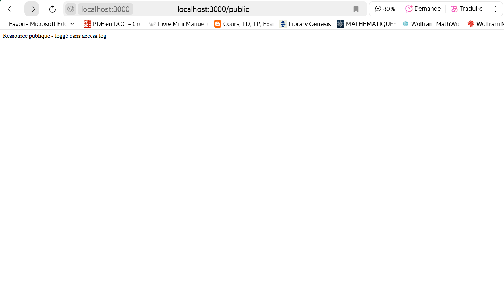

# Intégrer plusieurs middlewares tiers

## 📸 Capture d'écran  :

# Tableau de réponses compressées 

 

# Fichier de Logs ou écrit Morgan

 

# Accès Autorisé Public.

 

## 📝 Description  

Exercice 3: Intégrer plusieurs middlewares tiers
Configurez une application Express avec plusieurs middlewares tiers (morgan, cors, compression) et assurez-vous qu'ils sont exécutés dans le bon ordre.