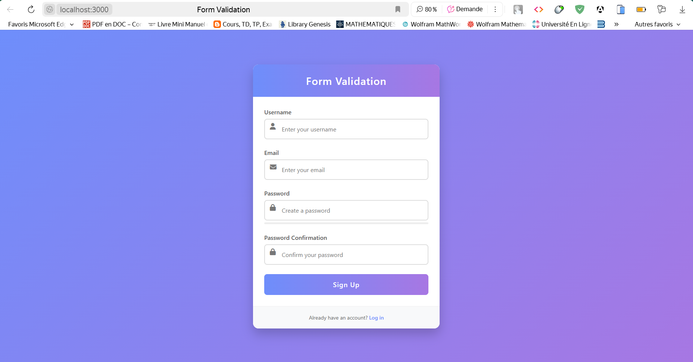
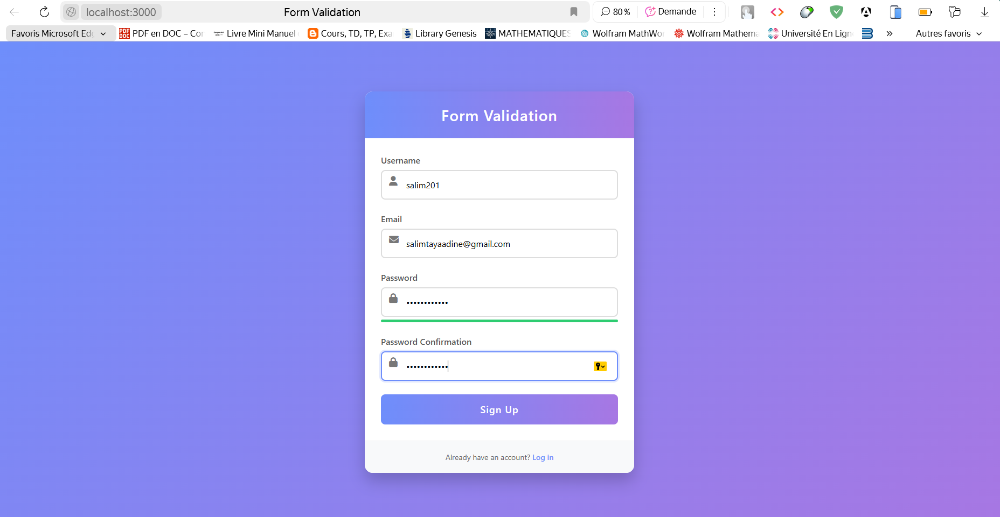
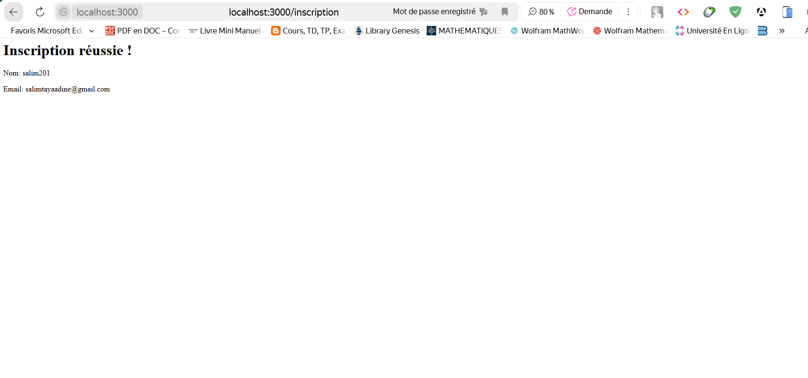

# Créer un formulaire et traiter sa soumission avec ExpressJS

## 📸 Capture d'écran  :

# Formulaire d'inscription

 

# Formulaire remplie

 

# Message d'inscription réussie

 

## 📝 Description  

Exercice 1 : Créer un formulaire et traiter sa soumission avec ExpressJS
Créez une application Express qui affiche un formulaire d'inscription et traite sa soumission. Le formulaire doit inclure des champs pour le nom, l'email et le mot de passe. Validez les données soumises et affichez un message de confirmation.