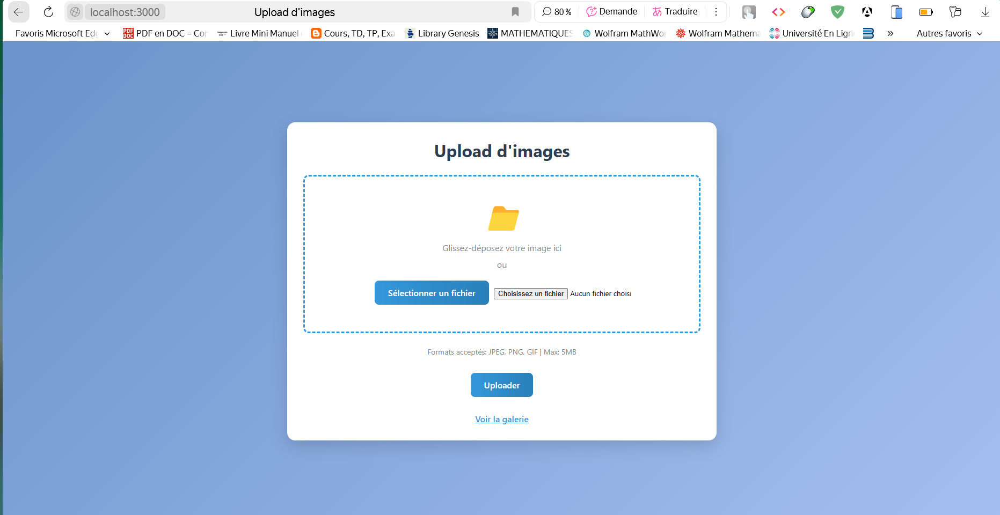
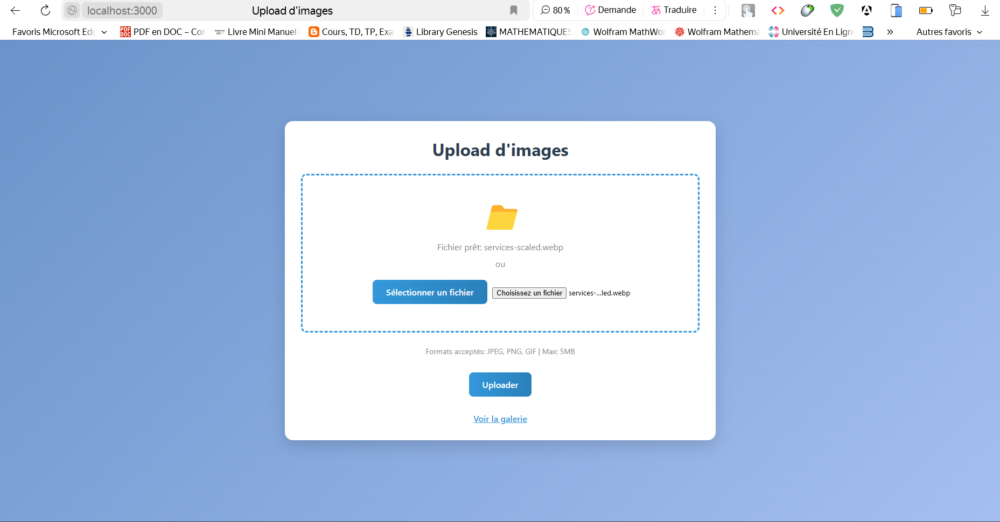
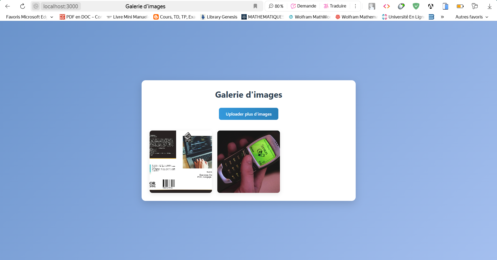
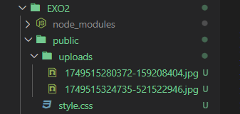

# Implémenter un système d'upload de fichiers

## 📸 Capture d'écran  :

# Accueil du projet

 

# Fichier choisir pour l'upload

 

# Affichage dans la galerie d'image le site

 

# Affichage dans la galerie d'image l'éditeur de code

 

## 📝 Description  

Exercice 2 : Implémenter un système d'upload de fichiers
Créez une application qui permet aux utilisateurs d'uploader des images. Limitez les types de fichiers acceptés aux images (JPEG, PNG, GIF) et la taille maximale à 5MB. Affichez les images uploadées dans une galerie.