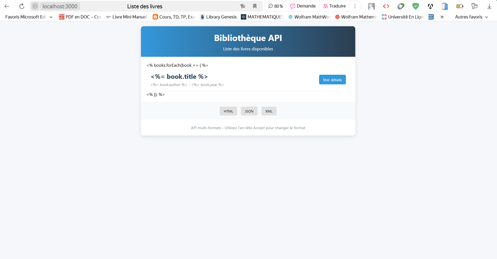
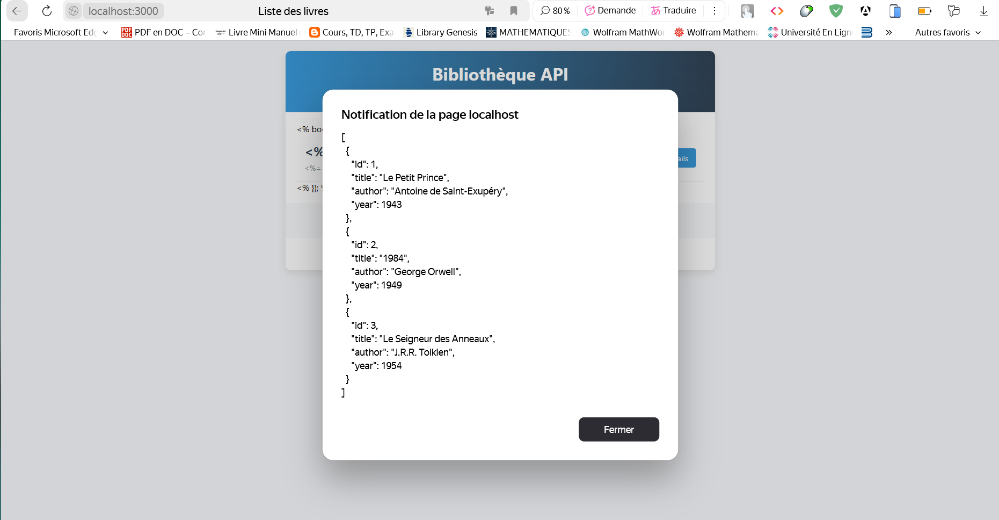
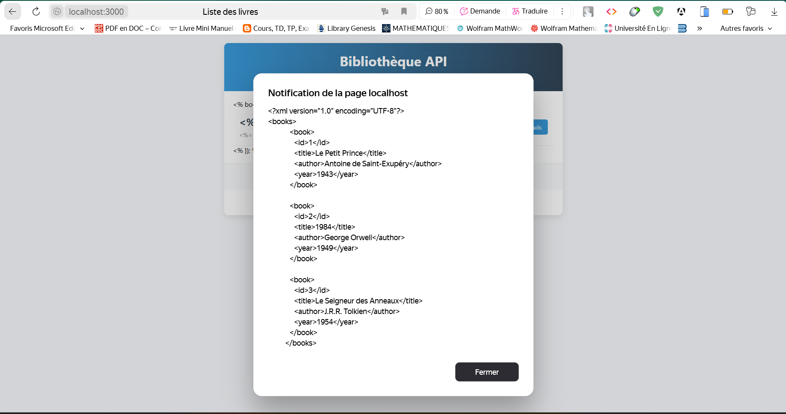

# Créer une API qui répond en différents formats

## 📸 Capture d'écran  :

# Accueil de l'API

 

# Format HTML

 

# Format JSON

 

# Format XML

 

## 📝 Description  

Exercice 3 : Créer une API qui répond en différents formats
Créez une API qui peut renvoyer des données dans différents formats (JSON, XML, HTML) en fonction de l'en-tête Accept envoyé par le client. Utilisez res.format() pour gérer les différents formats.