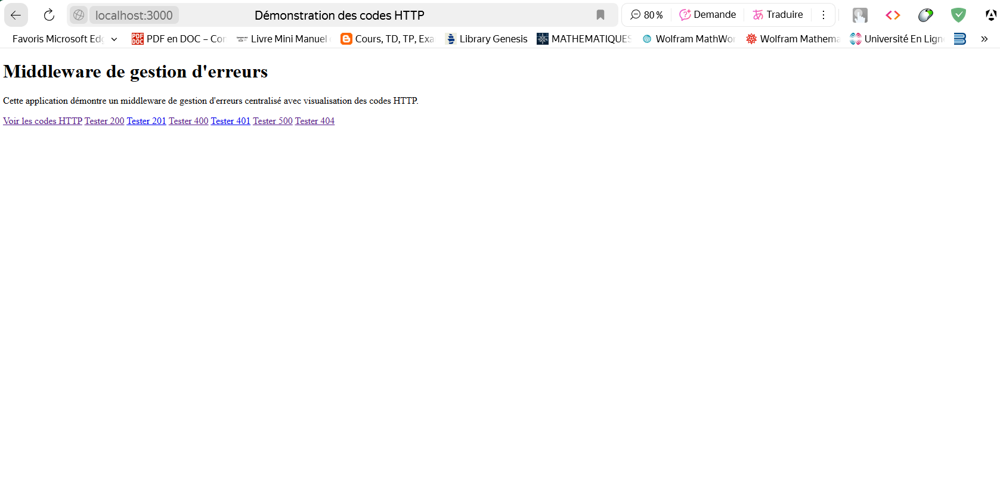
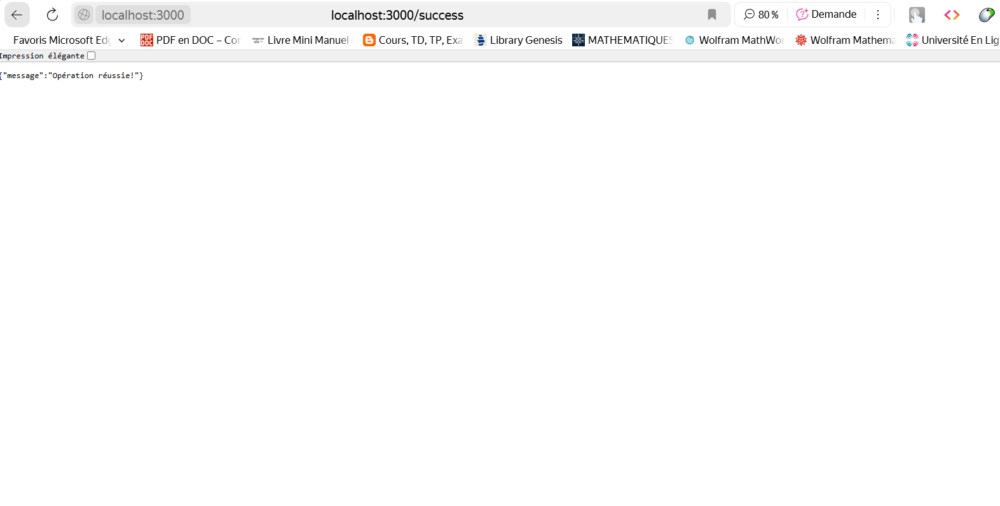
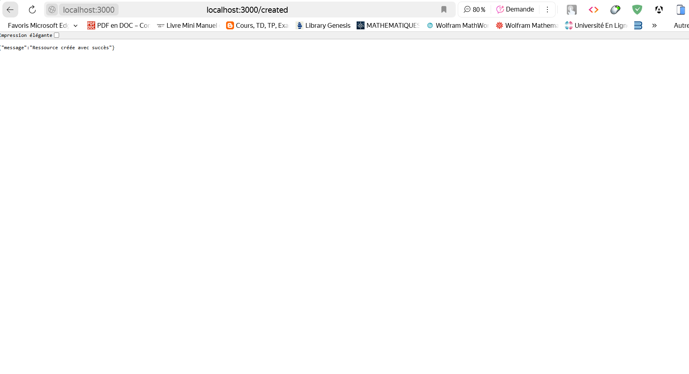
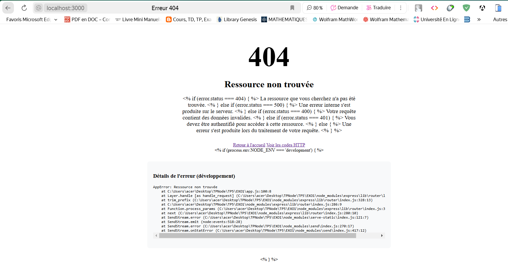
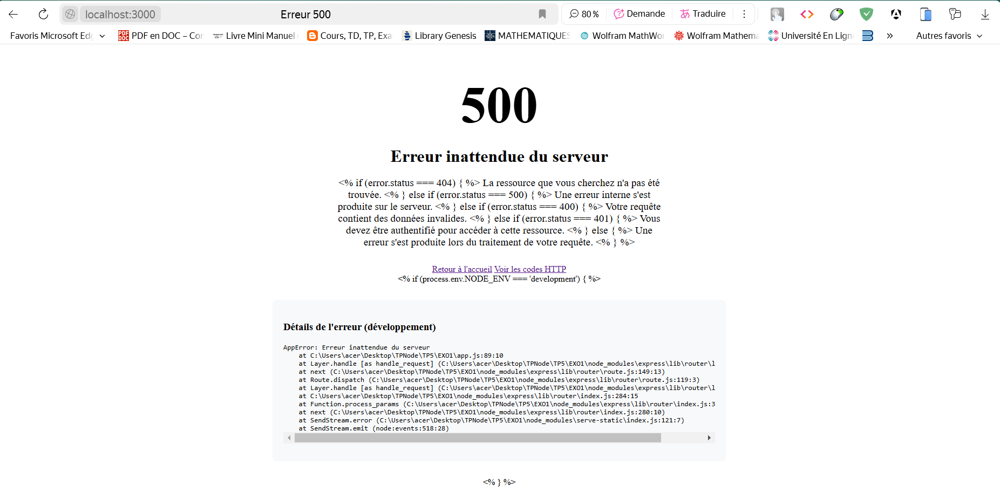
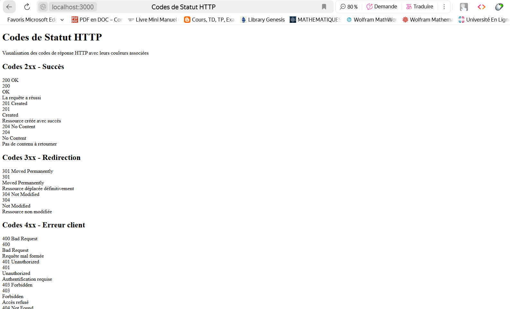

# Implémenter un middleware de gestion d'erreurs centralisé

## 📸 Capture d'écran  :

# Page d'accueil

 

# Code 200 Success

 

# Code 201 create

 

# Code 404 Error

 

# Code 500 Crach

 

# Page de Code Status

 

## 📝 Description  

Exercice 1: Implémenter un middleware de gestion d'erreurs centralisé
Créez un middleware de gestion d'erreurs qui :

Gère différents types d'erreurs (validation, authentification, etc.)
Formate les réponses d'erreur de manière cohérente
Journalise les erreurs avec différents niveaux de détail selon l'environnement