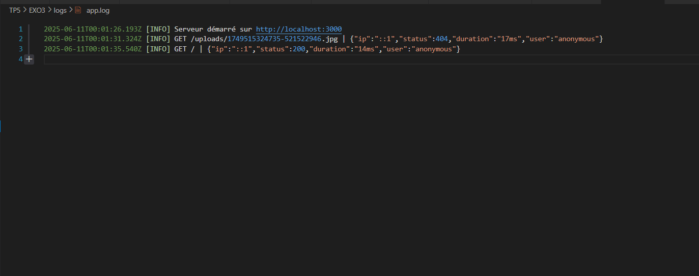
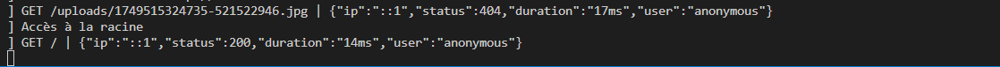
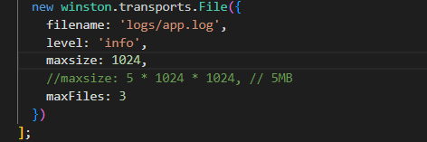

#  Mettre en place un système de logging

## 📸 Capture d'écran  :

# Fichier de log

 

# LOG avec information contextuelles

 

# Log sur la console

 

# Configuration de rotation du fichier log

 

après que le fichier atteindra 1024 octets, il sera remplacé par un autre fichier et ainsi de suite.

## 📝 Description  

Exercice 3: Mettre en place un système de logging
Implémentez un système de logging complet avec Winston qui :

Écrit les logs dans des fichiers et la console
Utilise différents niveaux de log
Inclut des informations contextuelles (IP, utilisateur, etc.)
Configure la rotation des logs